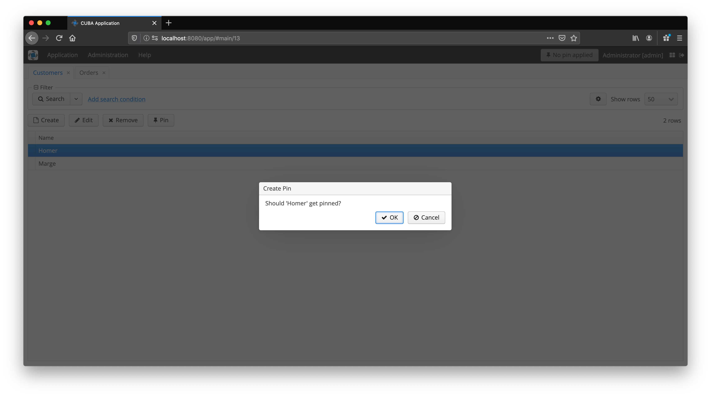

# cuba-component-entity-pin
CUBA component that allows to pin a particular entity to a user session.

Sometimes, as a user you have to drill down your entity graph for a particular selection of a particular entity. Here's an example:

Customer --(Composition)--> Order

Now you want to select a Customer and only see all entities (in this case only the Order) with the filter for a particular customer. Basically, as a user you "pin" your Customer.
Now the whole application acts as if you have only this customer in your application.

### Example

### Before applying Entity Pin

### Apply Customer Homer Pin

### After applying Entity Pin

